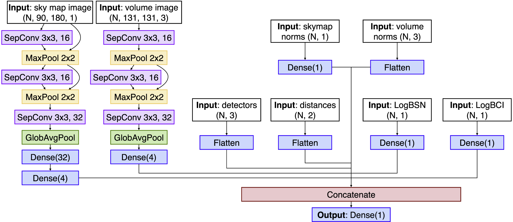
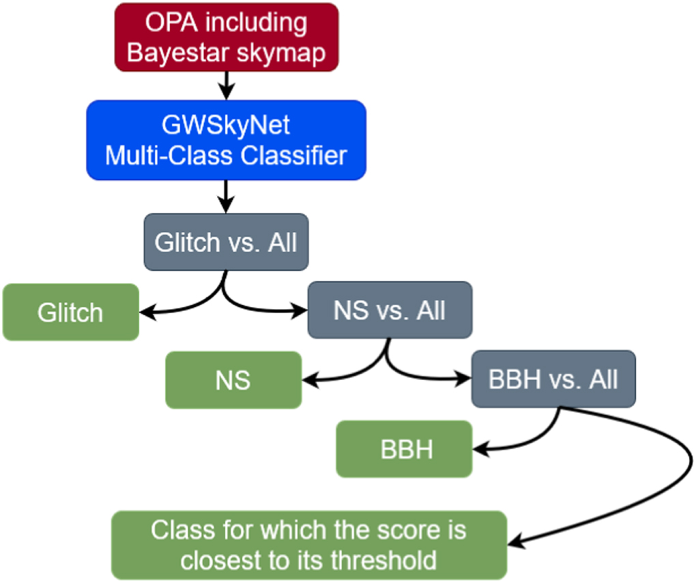
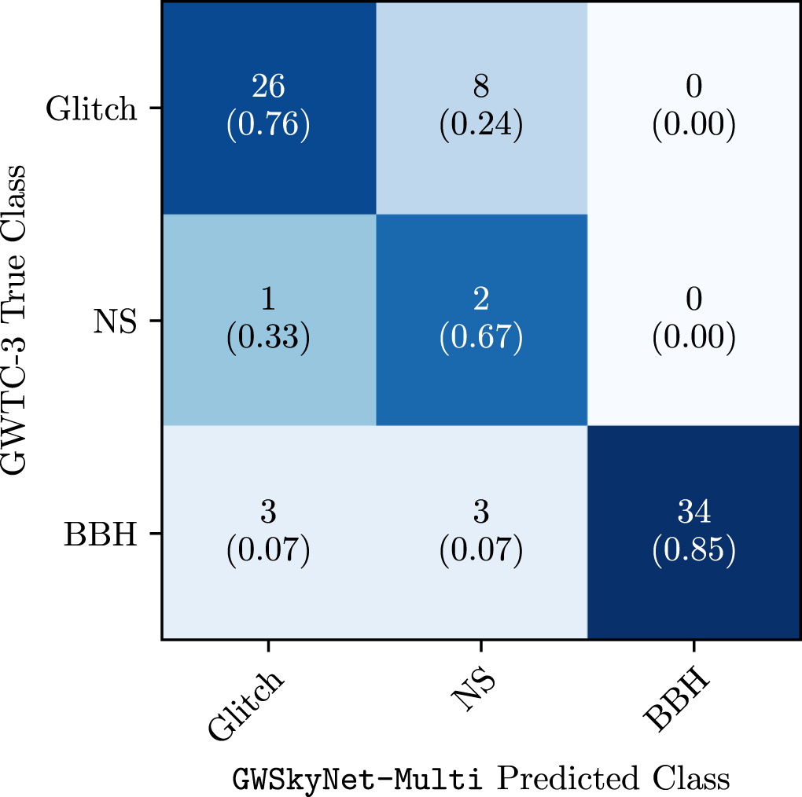

# GWSkyNet-Multi

GWSkyNet-Multi is a multi-class CNN classifier developed for the classification of candidate gravitational-wave events detected by the LIGO and Virgo observatories. This repository contains the published models together with scripts and instructions on how to use the classifier.

The model uses limited information released in the low-latency public alerts to produce prediction scores indicating whether an event is a merger of two black holes (BBH), a merger involving a neutron star (NS), or a non-astrophysical glitch. This facilitates time-sensitive decisions about whether to perform electromagnetic follow-up of candidate events during LIGO-Virgo-KAGRA (LVK) observing runs.

The details of the GWSkyNet-Multi model and its inner workings are described in [Abbott et al. (2022)](https://iopscience.iop.org/article/10.3847/1538-4357/ac5019) and [Raza et al. (2024)](https://iopscience.iop.org/article/10.3847/1538-4357/ad13ea).

## Inputs

The input to the classifier is the sky map FITS file generated for the candidate LVK event by the rapid localization pipeline [BAYESTAR](https://journals.aps.org/prd/abstract/10.1103/PhysRevD.93.024013), and released to the public on [GraceDB](https://gracedb.ligo.org). Note that these BAYESTAR sky maps are only produced for candidate compact binary coalescence (CBC) sources that are found by one of the online modeled search pipelines (see [here](https://emfollow.docs.ligo.org/userguide/analysis/searches.html#modeled-search) for details), and not for unmodeled burst sources. Thus GWSkyNet-Multi can only be used for CBC candidate events.

## Outputs

In the prediction results that are saved, the output for each classifier is the mean score of 20 trained models used, with the standard deviation of the 20 model scores quoted as the uncertainty (ensemble uncertainty estimate). The given final classification is based on applying score thresholds from training to the model results in a hierarchical order, and selecting the classification that occurs the most often.

### Architecture

GWSkyNet-Multi architecture for each one-vs-all classifier is the same. The first two branches are convolutional neural networks with residual connections for image data. The shape of the input data is indicated in parenthesis, with N the number of examples in the training set. The numbers in the SeparableConv2D (SepConv) and MaxPool layers indicate the kernel size in pixels and the number of filters (when applicable). The number in the Dense layers indicates the number of units.

### Hierarchical Classification

As GWSkyNet-Multi is a series of three one-vs-all classifiers, we need to apply a hierarchical scheme to arrive at a single final classification. Both the individual classifier scores and the final classification is reported by the model.

### Test Performance

False Positive Rate (FPR) and False Negative Rate (FNR) as functions of the score threshold on the testing set. We consider a threshold value for each classifier where the FPR=FNR.

### O3 Performance

Predicted vs. true classification confusion matrix for the 77 CBC candidate events in the LVK third observing run (O3) for which a public alert was issued. The predicted classifications are the GWSkyNet-Multi hierarchical ones. The true classifications are taken to be the ones from the final LVK O3 event catalog [GWTC-3](https://journals.aps.org/prx/abstract/10.1103/PhysRevX.13.041039). GWSkyNet-Multi misclassifies 15 (20%) of these events.

### Contents of this repository and how to use them

- The "data" folder contains the confidence thresholds that were determined for each model for which the False Negative Rate = False Positive Rate. The folder also contains the metadata from training that is necessary for normalizations.
- The "models" folder contains the trained machine learning models for each of the Glitch-vs-all, NS-vs-all, and BBH-vs-all classifiers. There are trained 20 versions of each model.
- The "predictions" folder is where the results of the GWSkyNet-Multi predictions are saved as individual text files.
- The "scripts" folder contains the python scripts that can be used to perform classification with GWSkyNet-Multi.
- The "skymaps" folder is where the scripts download and save the BAYESTAR sky map FITS files for each candidate event.

To set up the environment with the required packages you can use either the provided yml file (conda) or txt file (pip). The following commands should accomplish this: `$ conda env create --file gwskynet_multi_predictions.yml` or `$ python3 -m pip install -r requirements.txt`

If the user has the candidate event name, then the script [GWSkyNet_Multi_predict](scripts/GWSkyNet_Multi_predict.py) can be executed with the event name provided as an argument, which will download the FITS file from GraceDB, make the predictions, and save the results. Run the script with `--help` to see other argument details.

If the user wishes to launch a listener that uses a GCN stream for LVK public alerts, and then make predictions once a candidate CBC event alert is issued, then the script [LVK_alert_stream_and_predict](scripts/LVK_alert_stream_and_predict.py) can be executed. Note that the user's GCN client ID and client secret for the stream must be provided. If these have not already been set up, see the "Account Creation and Credential Generation" section at https://emfollow.docs.ligo.org/userguide/tutorial/receiving/gcn.html.
