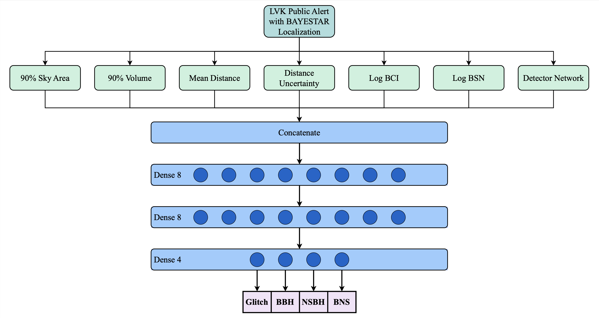
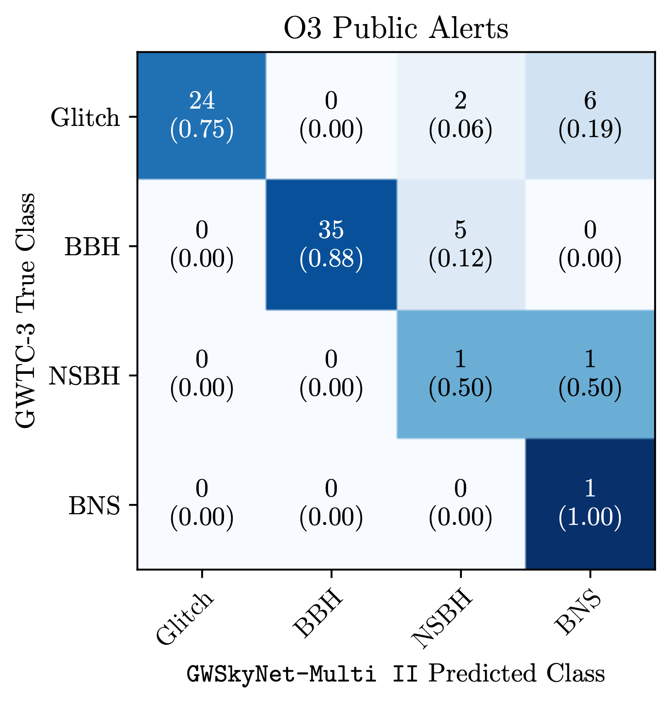

# GWSkyNet-Multi

GWSkyNet-Multi is a deep learning model developed for the classification of candidate gravitational-wave events detected by the LIGO and Virgo observatories. This repository contains the published models together with scripts and instructions on how to use the classifier.

The model uses localization information released in the low-latency public alerts to produce classification probabilities indicating whether an event is a binary black hole (BBH) merger, a neutron star - black hole (NSBH) merger, a binary neutron star (BNS) merger, or a non-astrophysical transient noise event in the detectors known as a "glitch". The classification facilitates time-sensitive decisions about whether to perform electromagnetic follow-up of candidate events during LIGO-Virgo-KAGRA (LVK) observing runs.

The latest model, GWSkyNet-Multi II, is described in [Raza et al. (2025)](https://www.arxiv.org/abs/2502.00297). Details of the original GWSkyNet-Multi model and its inner workings are described in [Abbott et al. (2022)](https://iopscience.iop.org/article/10.3847/1538-4357/ac5019) and [Raza et al. (2024)](https://iopscience.iop.org/article/10.3847/1538-4357/ad13ea).

## Inputs

The input to the classifier is the sky localization FITS file generated for the candidate LVK event by the rapid localization pipeline [BAYESTAR](https://journals.aps.org/prd/abstract/10.1103/PhysRevD.93.024013), and released to the public on [GraceDB](https://gracedb.ligo.org). Note that these BAYESTAR localization maps are only produced for candidate compact binary coalescence (CBC) sources that are found by one of the online modeled search pipelines (see [here](https://emfollow.docs.ligo.org/userguide/analysis/searches.html#modeled-search) for details), and not for unmodeled burst sources. Thus GWSkyNet-Multi can only be used to predict for candidate CBC events. The model is also trained on multi-detector events only, and so should not be used to predict on single detector events.

## Outputs

The final classifier outputs are the prediction probabilities of the four possible classes (Glitch, BBH, NSBH, BNS), averaged over 20 trained models, with the standard deviation of the 20 model predictions quoted as the uncertainty (ensemble uncertainty estimate). A classification label is provided by selecting the class with the highest predicted probability (users can apply other label selection criteria depending on their science use case).

## Contents of this repository and how to use it

- The "data" folder contains the normalization factors (from the training data) that need to be applied to the model inputs.
- The "models" folder contains the model file (json) for the model architecture and associated weights files (h5). There are 20 weights files corresponding to the final weights of the 20 trained models.
- The "predictions" folder is where the results of the GWSkyNet-Multi predictions are saved as individual text files.
- The "scripts" folder contains the python scripts that can be used to perform classification with GWSkyNet-Multi.
- The "skymaps" folder is where the scripts download and save the BAYESTAR localization FITS files for each candidate event.

To set up the environment with the required packages you can use either the provided yml file (conda) or txt file (pip). The following commands should accomplish this: `$ conda env create --file gwskynet_multi_predictions.yml` or `$ python3 -m pip install -r requirements.txt`

If the user has the candidate event name, then the script [GWSkyNet_Multi_predict](scripts/GWSkyNet_Multi_predict.py) can be executed with the event name provided as an argument, which will download the BAYESTAR FITS file from GraceDB, make the predictions, and save the results. Run the script with `--help` to see other argument details.

If the user wishes to launch a listener that uses a GCN stream for LVK public alerts, and then make predictions once a candidate CBC event alert is issued, then the script [LVK_alert_stream_and_predict](scripts/LVK_alert_stream_and_predict.py) can be executed. Note that the user's GCN client ID and client secret for the stream must be provided. If these have not already been set up, see the "Account Creation and Credential Generation" section at https://emfollow.docs.ligo.org/userguide/tutorial/receiving/gcn.html.

## Some Model Details

### Architecture

The GWSkyNet-Multi II model, shown below, is a neural network classifier and has only three layers following the concatenated inputs: 1) a dense layer of 8 neurons, 2) a second dense layer of 8 neurons, and 3) the final output dense layer of 4 neurons, each of which outputs the probability of the event belonging to one of the four classes: Glitch, BBH, NSBH, and BNS.

### O3 Performance

Predicted vs. true classification confusion matrix for the 75 multi-detector CBC candidate events in the LVK third observing run (O3) for which a public alert was issued. The true classifications are determined from the final LVK O3 event catalog [GWTC-3](https://journals.aps.org/prx/abstract/10.1103/PhysRevX.13.041039). GWSkyNet-Multi II correctly classifies 61/75 (81%) of O3 events.

